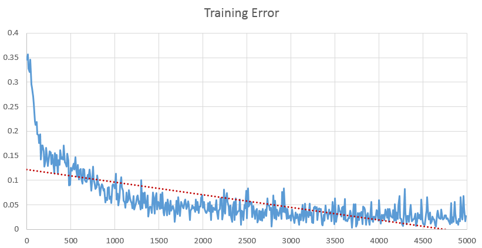
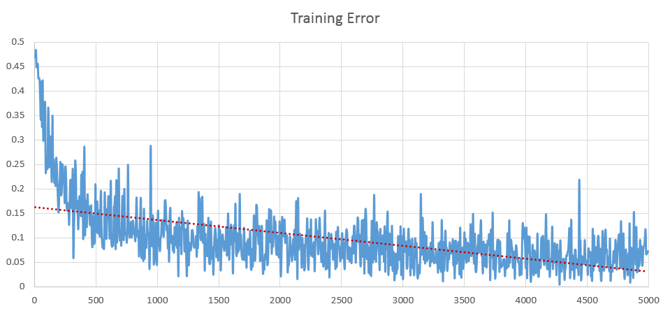

# Examples

## 1. Iris Classification 
normalized iris data used.

training data set: 120 samples 
test data set: 30 samples  
 
mini-batch size: 25
learning rate: 0.2
epochs: 5000

training   accuracy: % 97.5

validation accuracy: % 93.3

## 2. Mnist Classification
pixel density value inputs (0~255) are normalized by dividing each sample with 255.

training data set : 10000 samples
test data set : 2500 samples

mini-batch size: 20
learning rate: 0.2
epochs : 5000

training	accuracy:	% 93.55

validation	accuracy:	% 88

(Mnist dataset in csv format from https://pjreddie.com/projects/mnist-in-csv/)

## Boston house price prediction

